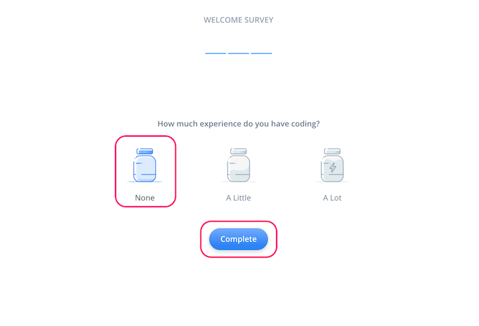

# Voiceflowハンズオン: Voiceflowアカウントの作成

## 概要

### はじめに

本資料は、VoiceflowでAlexaスキルを作成するための事前準備として、アカウント作成の手順を記載しています。

### 注意

Negative
: 本手順書は2020年4月22日時点のものですが、Voiceflowの開発はかなり活発なので、本手順書通りに進めてもうまくいかない場合や画面が変更されている場合があります。ご容赦ください。（必要な場合は補足します）

Positive
: 不具合やお気づきの点があれば、[https://github.com/kun432/voiceflow-handson-setup/issues](https://github.com/kun432/voiceflow-handson-setup/issues)に記載してください。

### 更新履歴

- 2019/11/21    公開
- 2020/04/22   最新化

ではNextをクリックしてください

## Amazon.co.jpアカウント/Amazon開発者アカウントの準備

VoiceflowでAlexaスキル開発を行うには、以下の3つのアカウントが必要になります。

1. Amazon.co.jpアカウント
2. Amazon開発者アカウント
3. Voiceflowアカウント

1と2については本資料では説明しませんが、以下の手順をご確認の上、ご準備ください。なお、非常にハマりやすいポイントが多々ありますので、ご注意ください。

- 失敗しないAlexa開発者アカウントの作り方
[https://dev.classmethod.jp/voice-assistant/how-to-safety-create-alexa-developers-account/](https://dev.classmethod.jp/voice-assistant/how-to-safety-create-alexa-developers-account/)

注意すべき点を以下に記載します。

### 1. Amazon.co.jpアカウント

Amazon.co.jpで普段のお買い物等でお使いいただいているアカウントがあればそれで結構です。そのアカウントでAmazon Echoを購入・使用されている場合は実機でも確認できますし、Amazon Echoがなくてもシミュレータでテストはできますので安心してください。（※ただし、Amazon Echoでしかテストできない機能もあります。）

もしお持ちでない場合は、上記手順を参考にアカウントを作成してください。

Negative
: "amazon.com"アカウントではなく"amazon.co.jp"アカウントであることを確認してください。

Negative
: "amazon.com"アカウントと"amazon.co.jp"アカウントの両方をお持ちで、メールアドレス・パスワードが同じになっている場合はハマります。どちらかのパスワードを変えてください。詳しくは以下をご覧ください。 
Amazon.comアカウントが優先してAlexaアプリに入れない問題の解決法
[https://dev.classmethod.jp/voice-assistant/solution-of-a-problem-amazon-com-account-conflict/](https://dev.classmethod.jp/voice-assistant/solution-of-a-problem-amazon-com-account-conflict/)

### 2. Amazon開発者アカウント

多分ここがまだの方という方が多いと思います。Amazon.co.jpアカウントを作成した、もしくはすでにお持ちの場合は、最初にご紹介した[「失敗しないAlexa開発者アカウントの作り方」](https://dev.classmethod.jp/voice-assistant/how-to-safety-create-alexa-developers-account/)の"Amazon Developerアカウントの登録"を参考に開発者登録を行ってください。

Negative
: 開発者「登録」が必要になります、といっても開発者アカウントを「新規作成」する必要はありません。上記のサイトにあるようにお持ちのAmazon.co.jpアカウントで「ログイン」して必要事項を入力するだけです。

Negative
: ここで新規作成しないように注意してください！ハマります。ここから新規作成を行った場合は以下を参考に解決してください。 
Alexa開発者アカウントのハマりどころ
[https://qiita.com/toshimin/items/3355a996008216dff741](https://qiita.com/toshimin/items/3355a996008216dff741)

これでAmazon側のアカウントの準備は完了です。続けて、Voiceflowアカウントを作成しましょう。

## Voiceflowアカウントの作成とログイン

### Voiceflowアカウントの作成

[https://voiceflow.com/](https://voiceflow.com/)にアクセスします。Voiceflowアカウントを持っていない方は、"Sign up"をクリックしてアカウントを作成しましょう。
※すでにアカウントを持っている方は、これ以降の作業は不要です。"Sign in"をクリックしてログインし、次の章に進みましょう。

名前、メールアドレス、パスワードを入力して、"Create Account"をクリックします。メールアドレスはamazon.co.jpアカウントと同じにしておくとわかりやすいかと思います。

Positive
: GoogleアカウントやFacebookアカウントでのアカウント作成も可能です。

最初にかんたんなアンケートがありますので、順に答えていきましょう。なお、どれを選択したとしてもVoiceflowの利用に影響はありませんので安心してください。"Continue"をクリックして進めます。

Voceflowを使う人（個人か、チームか）を聞いてくるので、適当に選んでください。選んだら、"Continue"をクリックします。

Voiceflowをどういうふうに使うのか（デザインやプロトタイピング、開発やリリース）を聞いてくるので、適当に選んでください。選んだら、"Continue"をクリックします。

プログラミング経験があるか？を聞いてくるので、適当に選んでください。（経験なし、少しだけ経験あり、経験豊富）。選んだら、"Complete"をクリックします。

以下の画面が出てきたらログイン完了です！ちなみに左上のアイコンの人がVoiceflowのCEOであるBradenさんです。右上の"☓"をクリックして閉じます。

これがVoiceflowの操作画面になります。画面の説明についてはこのあとのハンズオンの中で行います。ちなみにアカウント作成の直後は”My First Project" という最初のプロジェクトが開いた状態になっていますが、これは使いません。左上の"＜"をクリックします。

プロジェクトの一覧画面が表示されます。Voiceflowでは、Alexaスキルを「プロジェクト」という単位で管理します。右の列にあるのがさきほど開いていた、アカウント作成時に自動作成される「My First Project」ですね。

ハンズオンでは、この一覧画面でプロジェクトの新規作成から行いますので、このプロジェクトは使用しません。プロジェクトを作成するとこの画面に一覧表示される、ということを覚えておいていただければ結構です。

Positive
: 元々用意されているプロジェクトは削除してもかまいません。

Negative
: 削除したプロジェクトは復旧できませんので、ご注意ください。

これで準備が整いました。ではハンズオンをお楽しみに！